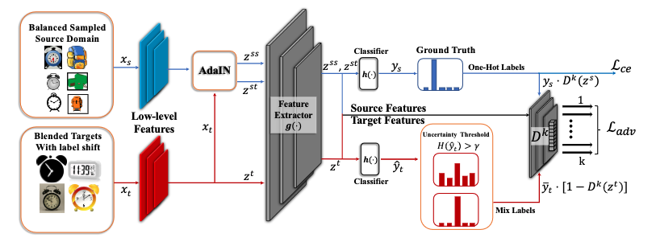

# Class-overwhelms-Mutual-Conditional-Blended-Target-Domain-Adaptation

Official Implementation for the **AAAI-2023 Oral paper** 

[Pengcheng Xu](https://github.com/Pengchengpcx), Boyu Wang, Charles Ling, [Class-overwhelms-Mutual-Conditional-Blended-Target-Domain-Adaptation](https://arxiv.org/abs/2302.01516)


### Prerequisites:
- python == 3.9.6
- pytorch ==1.12.1
- torchvision == 0.13.1
- numpy, scipy, sklearn, PIL, argparse, tqdm


### Dataset
- Please manually download the datasets [Office](https://drive.google.com/file/d/0B4IapRTv9pJ1WGZVd1VDMmhwdlE/view), [Office-Home](https://drive.google.com/file/d/0B81rNlvomiwed0V1YUxQdC1uOTg/view), [DomainNet](http://ai.bu.edu/M3SDA/#dataset)


### Framework


If you find our work useful in your research, please consider citing:
```latex
@article{xu2023class,
  title={Class Overwhelms: Mutual Conditional Blended-Target Domain Adaptation},
  author={Xu, Pengcheng and Wang, Boyu and Ling, Charles},
  journal={arXiv preprint arXiv:2302.01516},
  year={2023}
}
```


## License
This repository is released under MIT License (see LICENSE file for details).
